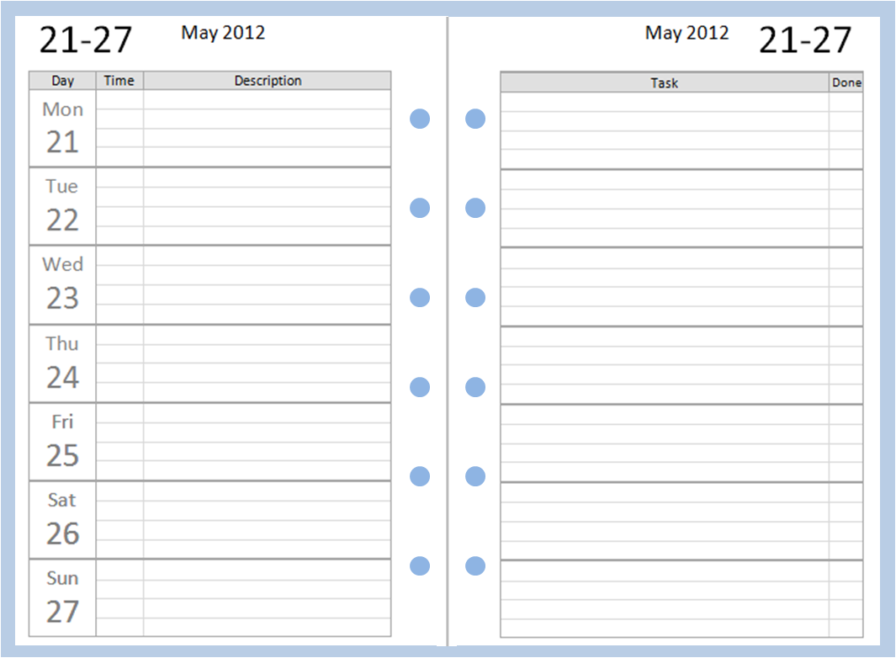

# Ejemplo de código

* Tienes que maquetar el diseño proporcionado de forma aproximada.
* Dinámicamente tiene que mostrar la semana actual.
* Además tienes que incluir (_con diseño a tu discreción_) los Santos de cada día de esa semana.
* Debes traerte en tiempo real la información de una api externa (p.e. [https://api.abalin.net]())

## Requisitos

* CSS estructurado y con un preprocesador de tu elección (SASS, Less)
* Vanilla JS. No uses frameworks pero puedes usar librerías externas (p.e. Moment.js si no quieres parsear las fechas tú mismo)
* Idealmente el código estará estructurado en módulos ES6, dicha estructura a tu discreción.
* Debe funcionar en las últimas versiones de los más navegadores comunes (Chrome, Firefox, Safari, Edge)

## Entregable

* Se espera un archivo con el código fuente necesario y las instrucciones de compilación.
* Idealmente las dependencias estarán controladas por un gestor de paquetes (p.e. npm)

## Maqueta

